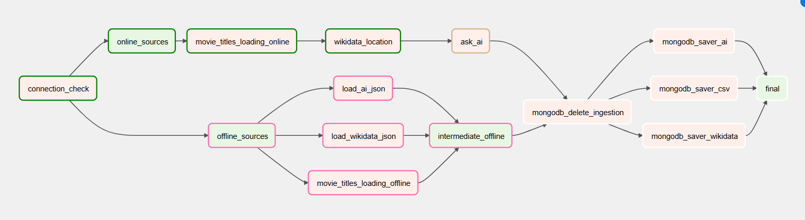
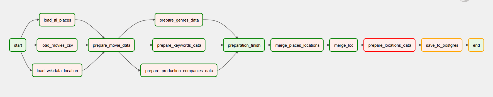
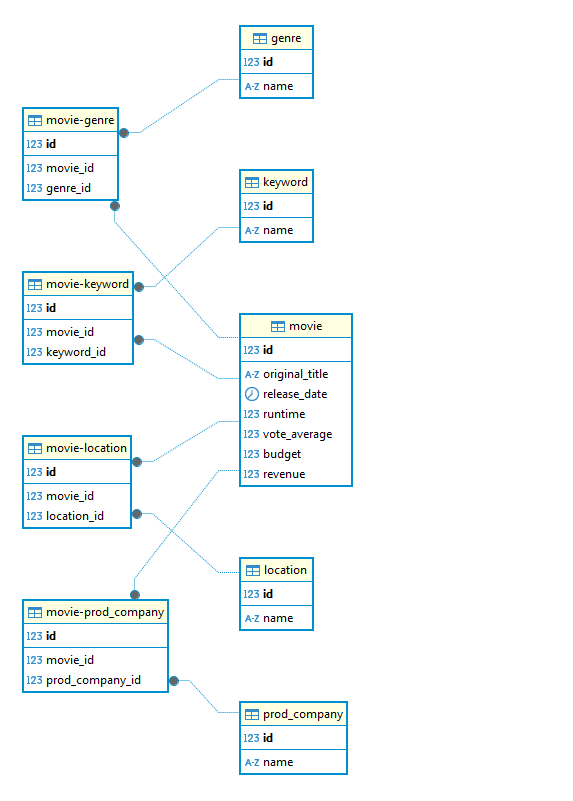
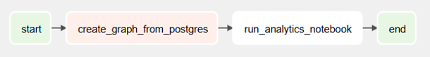
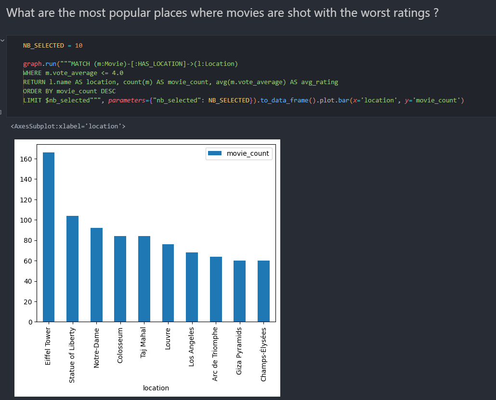

# Data engineering project

## Famous places appearing in movies and their impact on the movie rating

- Students : Julien BONDYFALAT & Clément VIAL
- Teacher : Riccardo TOMMASINI
- Course : Foundations of Data Engineering https://www.riccardotommasini.com/courses/dataeng-insa-ot/

## Project presentation

We wanted to work on data about movies and more importantly which factor could influence the rating of a movie. We decided to focus on the places where the movie was shot and see if it had an impact on the rating. We would like to visualise the data in a graph (on a map) and see if there is a correlation between the rating of a movie and the place where it was shot.

### Questions we would like to answer

- Is there a correlation between the rating of a movie and the place where it was shot?
- What are the most popular places where movies are shot?
- What are the most popular places where movies are shot with the best ratings?
- What are the most popular places where movies are shot with the worst ratings?
- Are places specialising in a specific genre of movie?

## Data sources

1. We used Kaggle to retrieve our initial movie set, their ratings and other informations : https://www.kaggle.com/datasets/anandshaw2001/movie-rating-dataset
2. Then we used wikidata to retrive in which city or country movies has been shot : https://query.wikidata.org/
3. Finally we wanted to get a list of every famous places and monument appearing in movies so we used grok AI to enrich our data : https://x.ai/

# Project steps

## Ingestion phase

The first dag is responsible for collecting the data. The choice that was made was to retrieve the data from kaggle then use these data for our query in wikidata and finally we use it in our prompt for Grok AI. The down half of the picture shows how the data is collected :

NB : We're using redis to store the data between the different steps of the ingestion phase.

## Staging phase

We have three different data sources: Kaggle, Wikidata, and Grok AI. To create a complete dataset, we need to merge these sources. This task is handled by the second DAG, which is responsible for extracting data from our MongoDB database, cleaning it, and creating dataframes that will be used to construct the final dataset and align it with the desired schema.

The lower half of the diagram illustrates the data merging and cleaning process, showing how the different sources are integrated and prepared.

The resulting schema is the following :

## Production phase

In this dag we convert our postgreSQL data into a graph database. We use the data from the previous step to create nodes and edges in the graph. We use the Neo4j database to store the data.

Here a visualisation of a part of the graph :

We then analyse this graph to answer the questions we asked ourselves. For that purpose, we created a Jupyter notebook that connects to the Neo4j database and retrieves the data we need to answer the questions. We plot the results in the notebook. The output is stored in the results folder in the file named out.ipynb.

Here's an example of the output :

## Next steps

- We could add more data sources to have a more complete dataset.
- Improve the way we retrieve famous places appearing in movies and how we clean the output of the AI
- Do more advanced analysis on the graph to be able to give a more precise answer to the questions we asked ourselves.
